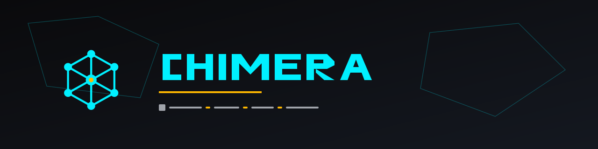
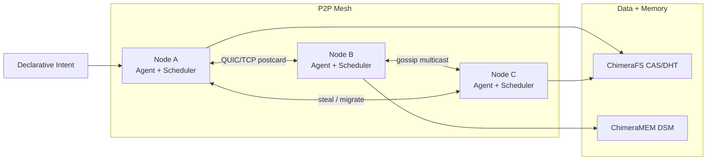
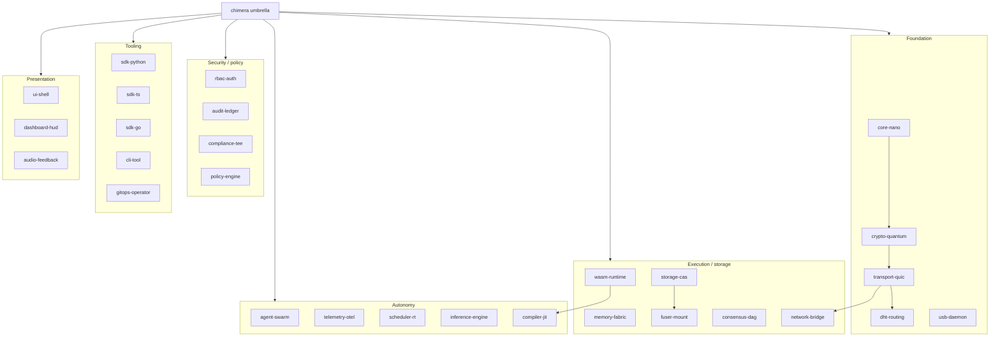
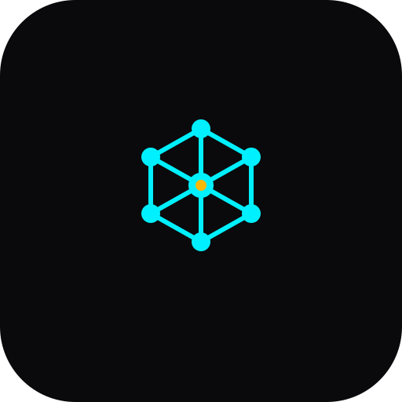

# Chimera

[](https://github.com/theworker02/chimera/actions)
[](./LICENSE)
[](https://crates.io/crates/chimera-mesh)
[](https://theworker02.github.io/chimera/)
[](./CODE_OF_CONDUCT.md)

<p align="center">
  
</p>

<p align="center">
  
</p>

**Chimera** turns LAN or secure-mesh machines into a unified virtual compute cluster — no master server, no control plane. Peers gossip, steal work, execute Wasm in a sandbox, stream content-addressed data, share memory pages, and negotiate jobs through local agents.

## Architecture



```
                    ┌─────────────────────────────────────┐
                    │           Intent / Agent            │
                    └──────────────┬──────────────────────┘
                                   │ plan
          ┌────────────────────────┼────────────────────────┐
          â–¼                        â–¼                        â–¼
   ┌─────────────┐         ┌─────────────┐          ┌─────────────┐
   │  Scheduler  │◄─steal─►│  Wasmtime   │─migrate─►│ ChimeraMEM  │
   │ work-steal  │         │  sandbox    │          │ soft DSM    │
   └──────┬──────┘         └──────┬──────┘          └──────┬──────┘
          │ prefetch              │ I/O                    │ pages
          â–¼                       â–¼                        â–¼
   ┌─────────────────────────────────────────────────────────────┐
   │ ChimeraFS (BLAKE3 CAS · gossip DHT · VirtualMount / FUSE*)  │
   └─────────────────────────────────────────────────────────────┘
   * FUSE optional (Unix feature); Windows uses VirtualMount VFS
```

| Phase | Capability |
|---|---|
| 1 | Gossip discovery, QUIC/TCP, work-stealing, Wasmtime, mmap pipeline, heartbeats/checkpoints, Ratatui TUI |
| 2 | ChimeraFS — CAS, DHT, prefetch, VirtualMount |
| 3 | ChimeraMEM — DSM, Wasm migration, CRDTs, tiering |
| 4 | Agents, intents, self-healing, ed25519 receipts |
| 5 | Brand system, ADRs/RFCs, docs, CI |
| 6 | **Chimera Nano-Kernel** — `no_std` core, wasmi tier, smoltcp framing, ML-KEM/ML-DSA handshake, deterministic replay |
| 7 | Enterprise mgmt — REST portal, RBAC, audit, join tokens, chimeractl, SDKs |
| 8 | **Chimera Nexus** — frame-budget RT scheduler, distributed ECS, C ABI / WIT |
| 9 | **Nexus Core** — Wasm function gateway, DHT registry routing, Raft KV, autoscaler, `chimeractl up` |
| 10 | **WorldOS** — MeshShell SPA, Freight packages, credit ledger, TCP bridge, CRDT collab |
| 11 | **Sovereign** — chimera-usb, WebGL dash, TEE/mTLS, retro-scaling, continuity |
| 12 | **Omniverse** — 28 modular crates/packages (`crates/` + `packages/`) |
| 14 | **Boot-Sovereign** — safety-gated USB flash/recovery (`chimera-boot`) |
| 15 | **Distribution** — crates.io naming, release pipeline, mdBook, binstall/brew |

## Install

```bash
# From crates.io (after a real release)
cargo install chimeractl
cargo install chimera-boot
cargo install chimera-mesh --bin chimera

# Or fetch GitHub Release binaries (matches release.yml artifact names)
cargo binstall chimeractl
cargo binstall chimera-boot

# Homebrew (tap lives in a separate homebrew-chimera repo; formula template in packaging/)
# brew tap theworker02/chimera && brew install chimeractl

# Prebuilt: download chimeractl-<platform> / chimera-boot-<platform> from GitHub Releases
# See RELEASING.md for the exact artifact matrix and checksums.
```

Umbrella library package: **`chimera-mesh`** (the name `chimera` is taken on crates.io). Depend with:

```toml
chimera = { version = "0.1", package = "chimera-mesh" }
```

Docs: [ADR-0024](./docs/adr/0024-distribution-publishing.md) · [RELEASING.md](./RELEASING.md)

## Phase 14 — Chimera Boot-Sovereign

> **âš  DATA LOSS WARNING:** `chimera-boot` can wipe disks. Defaults keep **dry-run ON**. Physical writes require `--yes-i-understand-this-destroys-data` **and** `--no-dry-run`, and **hard-refuse** non-removable/system disks. Automated tests use **file-backed images only**. **Real-hardware flashing is UNTESTED.**

Crate: [`crates/usb-flasher/`](./crates/usb-flasher/) (package `chimera-boot`). ADR: [ADR-0023](./docs/adr/0023-boot-sovereign-safety.md).

| Surface | Status |
|---|---|
| `FileImageTarget` + GPT/MBR/FAT32 round-trips | **working** (file images) |
| ISO / payload stream + BLAKE3 verify | **working** (file images) |
| `PhysicalDiskTarget` (Windows/Linux) | **implemented, gated** — **UNTESTED on hardware** |
| NTFS format | **roadmap / OS-delegated** (honest error) |
| EFI/MBR bootloader blobs | **user-supplied paths only** (none bundled) |
| `chimeractl usb list` | **working** (read-only; safe to run) |
| `chimeractl usb flash/verify/repair` | **working** against `--image`; physical gated |
| TUI **USB** tab | **working** (layout + pipeline pulse + disk list) |

```bash
cargo test -p chimera-boot
cargo run -p cli-tool -- usb list
# Lab flash (SAFE — file image):
cargo run -p cli-tool -- usb flash --image --target ./data/lab-usb.img --payload ./payload.bin --no-dry-run
```

## Phase 12 — Chimera Omniverse (28 modules)

Phases 1–11 logic is split into **exactly 28** independently usable modules. Rust libraries/binaries live under [`crates/`](./crates/); SDKs, GitOps, UI, and audio live under [`packages/`](./packages/). The root `chimera` package composes them into the full mesh node. Rationale and acyclic layering: [ADR-0022](./docs/adr/0022-omniverse-modules.md).



| # | Module | Purpose | Status |
|---|---|---|---|
| 1 | `core-nano` | `no_std` kernel bootstrapper | **working** |
| 2 | `transport-quic` | QUIC/UDP framing + wire protocol + mTLS helpers | **working** |
| 3 | `dht-routing` | S/Kademlia peer discovery + registry routing | **working** |
| 4 | `crypto-quantum` | ML-DSA + ML-KEM PQ suite (facade over CNK) | **working** |
| 5 | `usb-daemon` | Zero-privilege portable host device node | **working** |
| 6 | `wasm-runtime` | Sandboxed Wasm component executor | **working** |
| 7 | `memory-fabric` | DSM ring (uffd Linux / soft-page Windows) | **working** |
| 8 | `storage-cas` | BLAKE3 Merkle content-addressed blocks | **working** |
| 9 | `fuser-mount` | User-space VFS (FUSE Unix / VirtualMount Windows) | **working** (FUSE feature stub on Unix) |
| 10 | `consensus-dag` | BFT-ready tx graph (Raft KV + DAG hooks) | **working** (Raft primary; DAG layer where sensible) |
| 11 | `network-bridge` | Legacy TCP + BT/serial stubs + cross-domain wrap | **working** (BT/serial **simulated**/stubs) |
| 12 | `agent-swarm` | Decentralized local decision agents | **working** |
| 13 | `telemetry-otel` | OpenTelemetry tracing/metrics | **working** (OTLP optional feature) |
| 14 | `scheduler-rt` | Sub-16ms frame-budget scheduler (Nexus) | **working** |
| 15 | `inference-engine` | Local anomaly detector (statistical/rules) | **working** (lightweight; not heavy ML) |
| 16 | `compiler-jit` | Adaptive tier selection / retro-scaling | **working** |
| 17 | `rbac-auth` | Role-based permissions | **working** |
| 18 | `audit-ledger` | Hash-chained signed event log | **working** |
| 19 | `compliance-tee` | TEE attestation (simulated + TDX/TZ stubs) | **working** / stubs |
| 20 | `policy-engine` | Declarative YAML/JSON resource limits | **working** |
| 21 | `sdk-python` | Python management API client | **working** |
| 22 | `sdk-ts` | TypeScript management API client | **working** |
| 23 | `sdk-go` | Minimal Go management API client | **working** |
| 24 | `cli-tool` | `chimeractl` CLI | **working** |
| 25 | `gitops-operator` | K8s/Compose deploy scaffolding | **scaffolding** |
| 26 | `ui-shell` | Glassmorphic MeshShell container | **working** |
| 27 | `dashboard-hud` | WebGL ~120fps topology HUD | **working** (Vulkan **roadmap**) |
| 28 | `audio-feedback` | Procedural PCM/WAV + WebAudio tones | **working** |

```bash
cargo check --workspace
cargo test --workspace
cargo build --release --workspace
cargo check -p chimera-nano-kernel --no-default-features --target thumbv7em-none-eabihf
```

## Phase 6 — Chimera Nano-Kernel (CNK)

Silicon-agnostic execution matrix in [`crates/core-nano/`](./crates/core-nano/):

```bash
# Host-simulated boot (Windows)
cargo run -p chimera-nano-kernel --example host_boot

# no_std core check (Cortex-M target)
cargo check -p chimera-nano-kernel --no-default-features --target thumbv7em-none-eabihf
```

| Piece | Status |
|---|---|
| Block-pool allocator, TxLog replay, FixedPoint determinism | **Production-leaning on host** |
| wasmi interpreter tier | **Runnable** |
| ML-KEM-768 + ML-DSA-65 hybrid envelope + puzzles | **Tested on host** |
| smoltcp simulated device framing | **Tested** (QUIC-over-smoltcp **not** implemented) |
| UEFI / Cortex-M / RISC-V boots | **Scaffolding only** — see [docs/guides/cnk-targets.md](./docs/guides/cnk-targets.md) |

Docs: [ADR-0006](./docs/adr/0006-chimera-nano-kernel.md) · [ADR-0007](./docs/adr/0007-pq-hybrid-handshake.md) · [ADR-0008](./docs/adr/0008-deterministic-replay.md) · [RFC-0003](./docs/rfc/0003-cnk-pq-frames.md)

## Phase 7 — Enterprise management

Management API (default `http://127.0.0.1:7600`): health, Prometheus `/metrics`, intents, assets, join tokens, audit. Auth demo: `Authorization: Bearer admin:ops`.

```bash
cargo run --bin chimera -- --name alpha --no-tui --mgmt-bind 127.0.0.1:7600
cargo run -p cli-tool -- status
```

Docs: [ADR-0009](./docs/adr/0009-observability.md) · [ADR-0010](./docs/adr/0010-mgmt-rbac-sdks.md) · [ADR-0011](./docs/adr/0011-deployment.md) · [RFC-0004](./docs/rfc/0004-protocol-versioning.md)

## Phase 8 — Chimera Nexus (real-time interop)

Host crate [`crates/scheduler-rt/`](./crates/scheduler-rt/) (`chimera-nexus`): sub-16ms frame scheduler, ECS on TxLog, client prediction, C ABI + WIT. Engine embeds (Godot/Unreal) are **scaffolding** — unit-tested host APIs only.

```bash
cargo test -p chimera-nexus
```

## Phase 9 — Nexus Core (distributed application mesh)

Wasm function gateway, latency-aware registry routing, compact Raft KV, autoscaler + traffic shedder, and `chimeractl up`.

| Surface | Status |
|---|---|
| Wasm deploy / invoke (Wasmtime, fuel + memory caps) | **Working** |
| Service registry + failover routing | **Working** (userspace — **not** IP anycast) |
| Raft KV (+ host imports `chimera.kv_*`) | **Working** (in-process / lab replication) |
| Autoscaler + priority shedder (RT priority ≥ 200) | **Working** (unit-tested) |
| `chimeractl up` / `deploy` / `invoke` / `logs` / `scale` | **Working** on Windows |
| Container / Dockerfile ingest | **Roadmap** |
| SQL-over-KV | **Roadmap** |
| gRPC / event triggers | **Roadmap** |

### Quickstart (&lt;5 commands)

```bash
# 1) Build CLI + node
cargo build -p cli-tool --release
cargo build --bin chimera --release

# 2) One-click local fabric (foreground; Ctrl-C tears down)
./target/release/chimeractl.exe up --nodes 1 --chimera-bin ./target/release/chimera.exe

# 3–4) Deploy demo add1 Wasm and invoke (input 0x29 → 42)
./target/release/chimeractl.exe deploy demo --name add1
./target/release/chimeractl.exe invoke --function add1 --input-hex 29
```

Docs: [ADR-0012](./docs/adr/0012-function-gateway.md) · [ADR-0013](./docs/adr/0013-raft-kv.md) · [ADR-0014](./docs/adr/0014-service-routing.md) · [RFC-0005](./docs/rfc/0005-nexus-gateway.md)

## Phase 10 — WorldOS (decentralized hypergrid environment)

Grounded P2P OS surfaces on the existing mesh — not planet-scale marketing claims.

| Surface | Status |
|---|---|
| MeshShell browser SPA (`/meshshell`) over ChimeraFS | **Working** |
| Freight publish / search / install / run (signed Wasm) | **Working** |
| Credit ledger on Raft KV + gateway quota | **Working** (bypass default; `--enforce-credits`) |
| Plain-TCP legacy bridge | **Working** (tested) |
| Serial / Bluetooth adapters | **Stubs / roadmap** |
| CRDT collab notes over WebSocket | **Working** |
| Native GUI desktop shell | **Roadmap** (TUI + chimeractl today) |

### Quickstart

```bash
cargo run --bin chimera -- --name world --no-tui
# open http://127.0.0.1:7600/meshshell

cargo run -p cli-tool -- freight publish demo --name add1 --version 0.1.0
cargo run -p cli-tool -- freight install add1 --version 0.1.0
cargo run -p cli-tool -- freight run add1 --input-hex 29
```

Docs: [ADR-0015](./docs/adr/0015-freight.md) · [ADR-0016](./docs/adr/0016-credit-economy.md) · [ADR-0017](./docs/adr/0017-mesh-bridging.md) · [RFC-0006](./docs/rfc/0006-worldos.md)

## Phase 11 — Chimera Sovereign

Enterprise/security surfaces grounded in testable software. Hardware TEE / Vulkan / driverless USB are labeled honestly.

| Surface | Status |
|---|---|
| `usb-daemon` (`chimera-usb` binary) portable daemon + `--benchmark-startup` | **Working** (measured ms; OS still required) |
| MeshShell WebGL Sovereign Dash | **Working** (browser WebGL) |
| Vulkan / embedded native display | **Roadmap** |
| Simulated TEE attestation | **Working** |
| Intel TDX / SEV-SNP / TrustZone backends | **Roadmap stubs** |
| mTLS-over-QUIC lab helpers + tests | **Working** |
| Default LAN QUIC (no client cert) | **Working** (compat) |
| Retro-scaling policy (JIT vs wasmi) | **Working** |
| Continuity / partition recovery tests | **Working** (data loss prevention via replay — not wire ZPL) |
| Driverless USB autostart | **Roadmap** |

```bash
cargo run -p usb-daemon -- --benchmark-startup --root ./data/usb-lab
# example measured on this Windows host (debug/release vary): ~100–150ms portable init — always re-measure
cargo run --bin chimera -- --name sovereign --no-tui
# open http://127.0.0.1:7600/meshshell → Sovereign Dash
```

Docs: [ADR-0018](./docs/adr/0018-tee-attestation.md) · [ADR-0019](./docs/adr/0019-mtls-quic.md) · [ADR-0020](./docs/adr/0020-retro-scaling.md) · [ADR-0021](./docs/adr/0021-continuity.md) · [RFC-0007](./docs/rfc/0007-sovereign.md) · [ADR-0022](./docs/adr/0022-omniverse-modules.md)


## Quickstart

```bash
# Install Rust: https://rustup.rs
git clone https://github.com/theworker02/chimera.git
cd chimera

# One node with demo slices + TUI
cargo run -- --name alpha --demo-slices 4

# Headless intent job
cargo run -- --no-tui --intent "name=preview latency<200ms privacy=local render=hd slices=4"
```

Build the sample Wasm guest:

```bash
rustup target add wasm32-unknown-unknown
cargo build -p chimera-guest --release --target wasm32-unknown-unknown
cargo run -- --wasm target/wasm32-unknown-unknown/release/chimera_guest.wasm --demo-slices 2 --no-tui
```

## Brand

Palette: **void** `#0A0A0C` · **electric cyan** `#00F0FF` · **warning amber** `#FFB800`  
Guidelines & SVG lockups: [`brand/brand.md`](./brand/brand.md) · [`assets/brand/`](./assets/brand/)

| Asset | Preview |
|---|---|
| Mark |  |
| Icon |  |
| Banner | [`chimera-banner.svg`](./assets/brand/chimera-banner.svg) |

## Community & policies

- [Code of Conduct](./CODE_OF_CONDUCT.md) (Contributor Covenant v2.1)
- [Privacy Policy](./PRIVACY.md)
- [Contributing](./docs/guides/contributing.md)
- Site: [theworker02.github.io/chimera](https://theworker02.github.io/chimera/)

## Documentation

- ADRs: [`docs/adr/`](./docs/adr/) — QUIC, Wasmtime, CAS, DSM, agents, CNK, PQ, determinism, gateway, Raft, routing, Omniverse modules
- RFCs: [`docs/rfc/`](./docs/rfc/) — wire protocol, receipts, CNK/PQ frames, Nexus gateway
- Guides: [local mesh](./docs/guides/local-mesh.md) · [Wasm guests](./docs/guides/wasm-guest.md) · [CNK targets](./docs/guides/cnk-targets.md) · [contributing](./docs/guides/contributing.md)
- Book (Pages): [theworker02.github.io/chimera/book](https://theworker02.github.io/chimera/book/)

## Features (optional)

```bash
cargo check --features fuse          # Unix FUSE hook stubs
cargo check --features userfaultfd   # Linux uffd hook
cargo check --features zk-receipts   # ZK receipt stubs
cargo check --features ml-agent      # ML agent stub
# default features: cnk, mgmt, nexus
```

## License

MIT — see [`LICENSE`](./LICENSE).
