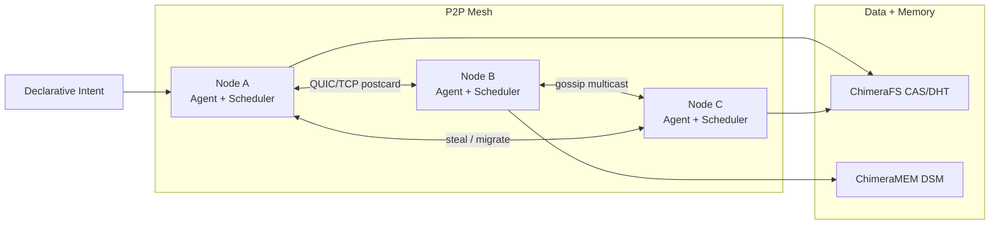
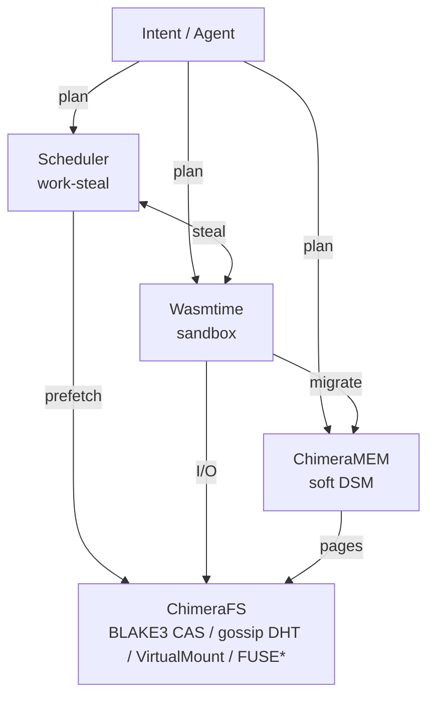

# Buyer evaluation — Chimera

## Goal

In 15–45 minutes, verify the Product builds or runs as documented and that proprietary notices are present.

## Steps

1. Confirm root `LICENSE` is proprietary and `ACQUISITION.md` exists.
2. Skim `README.md` install/run claims.
3. Execute:

```


```bash
# From crates.io (after a real release)
cargo install chimeractl
cargo install chimera-boot
cargo install chimera-mesh --bin chimera

# Or fetch GitHub Release binaries (matches release.yml artifact names)
cargo binstall chimeractl
cargo binstall chimera-boot

```

4. Run tests if present (`npm test`, `pytest`, `cargo test`, `go test ./...`, etc.).
5. Record README vs observed behavior gaps in workpapers.

## Pass criteria

- [ ] Clone succeeds
- [ ] Documented happy path works **or** failure is explained
- [ ] Minimal path needs no surprise secrets
- [ ] License notices intact

*Updated: 2026-09-22*
